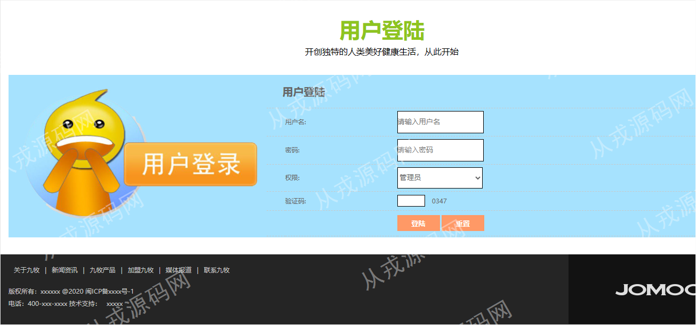
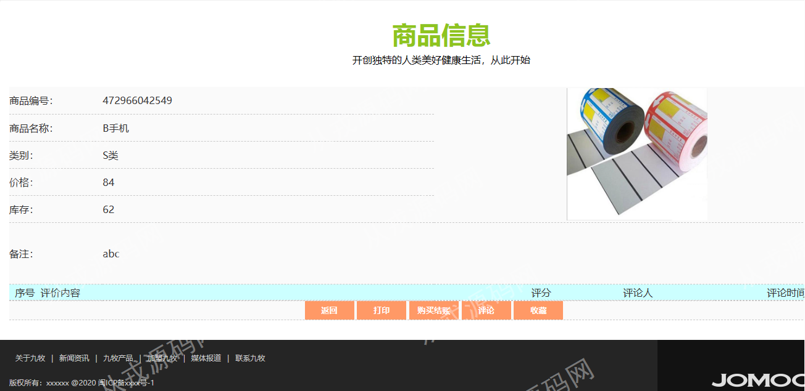
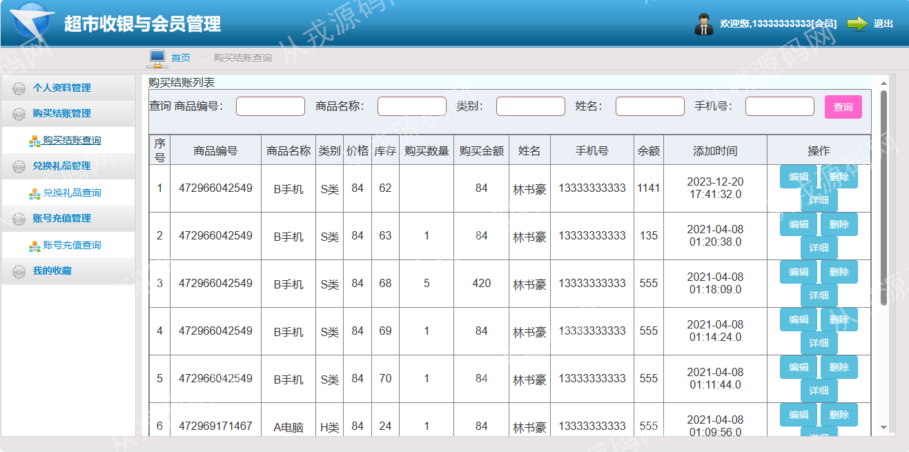

<h1 align="center">61.超市收银与会员管理系统</h1>

- <b>完整代码获取地址：从戎源码网 ([https://armycodes.com/](https://armycodes.com/))</b>
- <b>技术探讨、资料分享，请加QQ群：692619798</b> 
- <b>作者微信：19941326836  QQ：952045282</b> 
- <b>承接计算机毕业设计、Java毕业设计、Python毕业设计、深度学习、机器学习</b>
- <b>选题+开题报告+任务书+程序定制+安装调试+论文+答辩ppt 一条龙服务</b>
- <b>所有选题地址 ([https://github.com/YuLin-Coder/AllProjectCatalog](https://github.com/YuLin-Coder/AllProjectCatalog)) </b>

## 项目介绍
基于ssm的超市收银与会员管理系统：前端jsp、jquery，后端 springmvc、spring、mybatis，集成变化图管理、会员管理、商品类别管理、商品管理、账号充值、礼品管理以及统计等功能于一体的系统。

## 功能介绍

### 管理员

- 系统用户管理：管理员用户的增删改查，新增和修改的时候需要给管理员账号分配权限，权限分为超级管理员和普通管理员，密码修改
- 站内新闻管理：新闻信息的增删改查，关键词搜索，新闻首页图片上传，新闻内容支持富文本编辑
- 购物需知管理：购物需知信息的增删改查，关键词搜索，购物需知信息首页图片上传，购物需知内容支持富文本编辑
- 促销公告管理：促销公告信息的增删改查，关键词搜索，促销公告内容支持富文本编辑
- 系统简介设置：简介设置，关于我们设置，联系方式设置
- 留言管理：昵称和性别条件查询，留言列表，留言删除，留言回复
- 变化图管理：变化图的增删改查，图片上传，富文本编辑
- 会员管理：会员信息的增删改查，多条件查询
- 商品类别管理：商品类别的增删改查，关键词查询
- 商品管理：商品信息的增删改查，商品入库，库存预警提示
- 账号充值：账号余额进行充值操作
- 购买结账管理：多条件查询，编辑，删除，详情
- 礼品管理：礼品信息的增删改查，兑换礼品信息的编辑、详情和删除
- 会员统计：按性别统计，饼图显示
- 商品统计：按商品类别统计，饼图显示
- 购买结账统计：按类别统计，饼图显示

### 会员

- 基本功能：登录、注册、安全退出
- 网站前台：大轮播图，网站主导航，新闻信息，商品信息列表，商品详情，礼品信息，系统概要，在线留言
- 网站后台：个人资料管理，购买结账管理，兑换礼品管理，账号充值管理，我的收藏

## 环境

- <b>IntelliJ IDEA 2021.3</b>

- <b>Mysql 5.7.26</b>

- <b>Tomcat 7.0.73</b>

- <b>JDK 1.8</b>

## 运行截图

